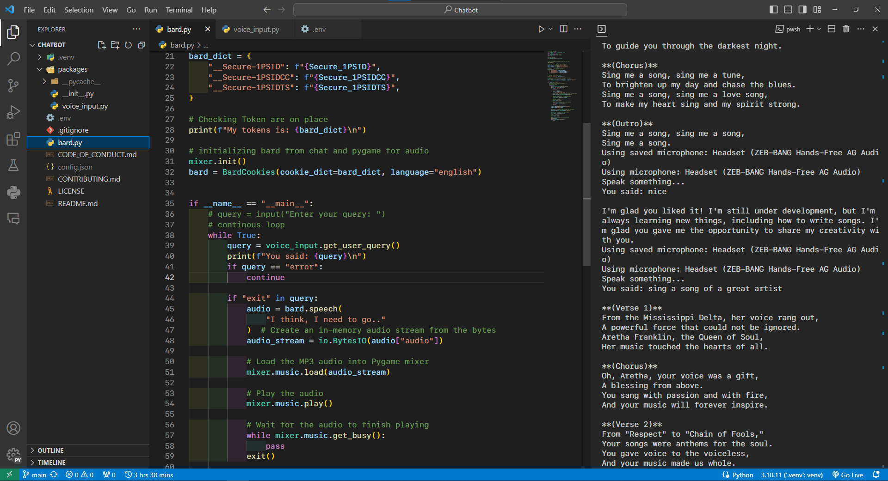

# Bard Chatbot with Voice Input and Audio Playback



A Python-based chatbot project that integrates the Bard API for natural language processing and voice interaction. This chatbot can listen to voice input, process user queries, and respond with audio output.

## Prerequisites

Before getting started, make sure you have the following dependencies installed:

- Python 3.x
- Pygame library
- SpeechRecognition library
- dotenv library
- Bard API credentials (You will need to sign up for Bard API and obtain API tokens)

You can install the required Python libraries using pip:

```bash
pip install -r requirements.txt
```

## Configuration

1. Create a `.env` file in the project directory and add your Bard API tokens:

   ```env
   Secure_1PSID=your_secure_1PSID_token
   Secure_1PSIDCC=your_secure_1PSIDCC_token
   Secure_1PSIDTS=your_secure_1PSIDTS_token
   ```

2. Make sure you have an active microphone connected to your system.

3. (Optional) Make changes in
   `.venv\Lib\site-packages\bardapi\core.py`
   if gives any error like requests not found.

add at top:

```python
import requests
```

4. (Optional) Make changes in
   `..venv\Lib\site-packages\bardapi\models\tools\map.py`
   if gives any error like Tuple not found.

add at top:

```python
from typing import Optional, Tuple, List

```

## Usage

Run the `bard.py` script to start the chatbot with voice input and audio playback:

```bash
python bard.py
```

The chatbot will listen for your voice input, process your queries using Bard API, and respond with audio output. You can speak your queries and receive spoken responses from the chatbot.

To exit the chatbot, simply say "exit" or type "/exit" in the text input.
To stop audio, simply say "stop" or type "/stop" in the text input.

## Features

- Voice-based interaction with the chatbot.
- Natural language processing powered by Bard API.
- Audio responses for a more interactive experience.

## Contributing

Contributions are welcome! If you'd like to improve this project or add new features, please fork the repository and submit a pull request. Feel free to open issues for bug reports or feature requests.

## License

This project is licensed under the MIT License - see the [LICENSE](LICENSE) file for details.

## Acknowledgments

- Thanks to the creators of Bard API for providing powerful natural language processing capabilities.
- Special thanks to the open-source community for the libraries used in this project.

Replace `your_secure_1PSID_token`, `your_secure_1PSIDCC_token`, and `your_secure_1PSIDTS_token` in the `.env` section with your actual Bard API tokens.
